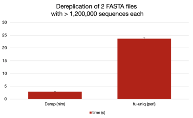

# FASTA/FASTQ Dereplication

* derep 0.5.0

Dereplicate sequence files, supporting gzipped input files. 
If sequence names contains the `;size=INT` string, it will be used in the count (see example input)

```
derep

Dereplicate FASTA (and FASTQ) files, print dereplicated sorted by cluster size with ';size=NNN' decoration.

Usage:
  derep [options] [inputfile ...]

Arguments:
  [inputfile ...]

Options:
  -k, --keep-name            Do not rename sequence, but use the first sequence name
  -i, --ignore-size          Do not count 'size=INT;' annotations (they will be stripped in any case)
  -v, --verbose              Print verbose messages
  -m, --min-size=MIN_SIZE    Print clusters with size equal or bigger than INT sequences (default: 0)
  -p, --prefix=PREFIX        Sequence name prefix (default: seq)
  -s, --separator=SEPARATOR  Sequence name separator (default: .)
  -w, --line-width=LINE_WIDTH
                             FASTA line width (0: unlimited) (default: 0)
  -l, --min-length=MIN_LENGTH
                             Discard sequences shorter than MIN_LEN (default: 0)
  -x, --max-length=MAX_LENGTH
                             Discard sequences longer than MAX_LEN (default: 0)
  -c, --size-as-comment      Print cluster size as comment, not in sequence name
  -h, --help                 Show this help
Missing arguments.

```

### Input

A set of FASTA or FASTQ files. If the sequence name contains the `size=INT` flag, it will be counted.
Example: [test.fasta](test.fa)


### Benchmark
 
Compared with a similar Perl script:

| Command | Mean [ms] | Min [ms] | Max [ms] | Relative |
|:---|---:|---:|---:|---:|
| `derep_Darwin ./input/*.fa*` | 112.8 ± 2.1 | 110.5 | 115.5 | 1.00 |
| `perl fu-uniq ./input/*.fa*` | 912.6 ± 31.6 | 877.2 | 962.9 | 8.09 ± 0.32 |



